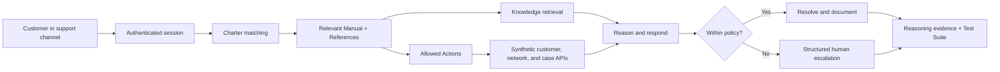

# Solution architecture

## Outcome

Resolve a high-friction international-roaming problem without forcing the customer or frontline agent to reconcile multiple systems. The solution must remain explainable, testable, and safe when an action exceeds policy.

## Runtime flow

## Maven design

### Charter tree

1. **Global Service Rules** — foundational, no Segment. Establishes identity, evidence, privacy, and safe-action rules.
2. **International Roaming Support** — selected when `support_intent = international_roaming`. Provides diagnostic decision logic and references roaming Knowledge and operational Actions.
3. **Financial Controls** — selected when `requested_credit_amount > 50` beneath the roaming Charter. Larger amounts expose escalation only.

Maven does not automatically make all Knowledge and Actions available to every conversation. Each capability must be referenced by the active Charter path. This design treats that constraint as a security boundary.

### Knowledge

Five small Markdown sources separate stable concepts:

- international-roaming troubleshooting;
- synthetic international-roaming authorization behavior;
- network-registration recovery;
- synthetic billing-credit limits; and
- escalation requirements.

### Actions

| Action | Reads/writes | Guardrail |
|---|---|---|
| `getCustomerContext` | Reads plan and authenticated customer facts | Requires customer ID from trusted session context |
| `getRoamingStatus` | Reads enrollment, usage, and network state | No mutation |
| `refreshNetworkRegistration` | Performs reversible network refresh | Requires Maven's native user confirmation; uses a supplied or deterministic idempotency key |
| `escalateToHuman` | Creates a structured case | Used for high-value credits and unresolved failures |

### Evidence

During the demo, Maven Simulator's **Show Reasoning** view should prove which user context, Knowledge, and Actions were considered and used. Test Suites provide repeatable quality evidence across happy path, policy boundary, failure, and ambiguity cases.

## Failure design

- `401/403`: stop and explain that authorization is missing; do not retry with guessed identity.
- `404`: verify the synthetic customer or case identifier once, then escalate.
- `409`: treat a matching idempotency key as an already-completed safe result.
- `429/5xx/timeout`: retry once only when the action is read-only or idempotent, then escalate with diagnostics.
- Credit above `$50`: never issue automatically; create a human escalation.

## Production evolution

The interview sandbox uses self-contained Maven Actions to remove hosting and credential risk during the live demo. The repository also preserves external-API adapters and a local synthetic API as the production-shaped evolution. A production deployment would add enterprise identity, audited service accounts, rate limits, observability, formal policy ownership, and a Maven App when reusable packaging or more complex lifecycle management is justified.
